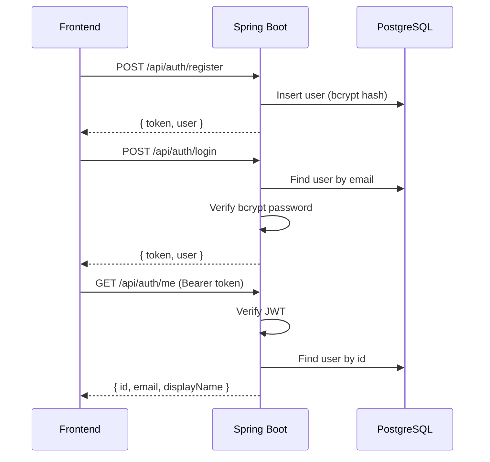

# EN Practice — Backend API Specification

Tài liệu chi tiết để xây dựng backend Spring Boot cho ứng dụng EN Practice.

## Mục lục
- [Tổng quan](#tổng-quan)
- [Database Schema](#database-schema)
- [Authentication Flow](#authentication-flow)
- [API Endpoints](#api-endpoints)
- [Spring Boot Setup](#spring-boot-setup)
- [Ví dụ curl](#ví-dụ-curl)

---

## Tổng quan

| Thông tin | Chi tiết |
|-----------|----------|
| **Framework** | Spring Boot 3.x |
| **Database** | PostgreSQL |
| **Auth** | JWT (JSON Web Token) |
| **Port mặc định** | `8080` |
| **Base URL** | `http://localhost:8080/api` |
| **Content-Type** | `application/json` |

### Dependencies cần thiết (pom.xml / build.gradle)
- `spring-boot-starter-web`
- `spring-boot-starter-data-jpa`
- `spring-boot-starter-security`
- `spring-boot-starter-validation`
- `postgresql` (driver)
- `jjwt-api`, `jjwt-impl`, `jjwt-jackson` (io.jsonwebtoken)
- `lombok` (optional)

---

## Database Schema

File SQL: [`server/schema.sql`](file:///d:/CODE2026/en-practice/server/schema.sql)

### Entity Mapping

#### User Entity
```java
@Entity
@Table(name = "users")
public class User {
    @Id
    @GeneratedValue(strategy = GenerationType.UUID)
    private UUID id;

    @Column(unique = true, nullable = false)
    private String email;

    @Column(name = "password_hash", nullable = false)
    private String passwordHash;

    @Column(name = "display_name", nullable = false)
    private String displayName;

    @Column(name = "created_at")
    private Instant createdAt;

    @Column(name = "updated_at")
    private Instant updatedAt;
}
```

#### VocabularyRecord Entity
```java
@Entity
@Table(name = "vocabulary_records")
public class VocabularyRecord {
    @Id
    @GeneratedValue(strategy = GenerationType.UUID)
    private UUID id;

    @Column(name = "user_id", nullable = false)
    private UUID userId;

    @Column(name = "english_word", nullable = false)
    private String englishWord;

    @Column(name = "user_meaning", nullable = false)
    private String userMeaning;

    @Column(name = "correct_meaning", nullable = false)
    private String correctMeaning;

    @Type(JsonBinaryType.class)
    @Column(columnDefinition = "jsonb")
    private List<String> alternatives;

    @Type(JsonBinaryType.class)
    @Column(columnDefinition = "jsonb")
    private List<String> synonyms;

    @Column(name = "is_correct", nullable = false)
    private boolean isCorrect;

    @Column(name = "tested_at")
    private Instant testedAt;
}
```

#### ReviewSession Entity
```java
@Entity
@Table(name = "review_sessions")
public class ReviewSession {
    @Id
    @GeneratedValue(strategy = GenerationType.UUID)
    private UUID id;

    @Column(name = "user_id", nullable = false)
    private UUID userId;

    private String filter;
    private int total;
    private int correct;
    private int incorrect;
    private int accuracy;

    @Type(JsonBinaryType.class)
    @Column(columnDefinition = "jsonb")
    private List<Map<String, Object>> words;

    @Column(name = "reviewed_at")
    private Instant reviewedAt;
}
```

> [!TIP]
> Dùng thư viện `hibernate-types` hoặc `hypersistence-utils` để hỗ trợ kiểu `JSONB` trong JPA.

---

## Authentication Flow



### JWT Configuration
| Thuộc tính | Giá trị đề xuất |
|------------|-----------------|
| **Algorithm** | HS256 |
| **Secret key** | Cấu hình qua `application.yml` (`jwt.secret`) |
| **Expiration** | 7 ngày (604800000 ms) |
| **Token prefix** | `Bearer ` |
| **Header** | `Authorization` |

### Spring Security Config
```java
@Configuration
@EnableWebSecurity
public class SecurityConfig {
    @Bean
    public SecurityFilterChain filterChain(HttpSecurity http) throws Exception {
        http
            .csrf(csrf -> csrf.disable())
            .cors(cors -> cors.configurationSource(corsConfigSource()))
            .sessionManagement(sm -> sm.sessionCreationPolicy(STATELESS))
            .authorizeHttpRequests(auth -> auth
                .requestMatchers("/api/auth/**").permitAll()
                .anyRequest().authenticated()
            )
            .addFilterBefore(jwtFilter, UsernamePasswordAuthenticationFilter.class);
        return http.build();
    }

    @Bean
    public CorsConfigurationSource corsConfigSource() {
        CorsConfiguration config = new CorsConfiguration();
        config.setAllowedOrigins(List.of("http://localhost:5173", "http://localhost:5174"));
        config.setAllowedMethods(List.of("GET", "POST", "PUT", "DELETE"));
        config.setAllowedHeaders(List.of("*"));
        config.setAllowCredentials(true);
        UrlBasedCorsConfigurationSource source = new UrlBasedCorsConfigurationSource();
        source.registerCorsConfiguration("/**", config);
        return source;
    }
}
```

---

## API Endpoints

### 1. Authentication — `/api/auth`

#### POST `/api/auth/register`
Đăng ký tài khoản mới.

**Request:**
```json
{
  "email": "user@example.com",
  "password": "mypassword",
  "displayName": "Nguyễn Văn A"
}
```

**Response (201):**
```json
{
  "token": "eyJhbGciOiJIUzI1NiJ9...",
  "user": {
    "id": "550e8400-e29b-41d4-a716-446655440000",
    "email": "user@example.com",
    "displayName": "Nguyễn Văn A"
  }
}
```

**Errors:**
| Status | Trường hợp |
|--------|-----------|
| 400 | Email đã tồn tại, validation fail |
| 500 | Server error |

---

#### POST `/api/auth/login`
Đăng nhập.

**Request:**
```json
{
  "email": "user@example.com",
  "password": "mypassword"
}
```

**Response (200):**
```json
{
  "token": "eyJhbGciOiJIUzI1NiJ9...",
  "user": {
    "id": "550e8400-e29b-41d4-a716-446655440000",
    "email": "user@example.com",
    "displayName": "Nguyễn Văn A"
  }
}
```

**Errors:**
| Status | Trường hợp |
|--------|-----------|
| 401 | Email/password sai |

---

#### GET `/api/auth/me`
Lấy thông tin user hiện tại. **Yêu cầu JWT.**

**Response (200):**
```json
{
  "id": "550e8400-e29b-41d4-a716-446655440000",
  "email": "user@example.com",
  "displayName": "Nguyễn Văn A"
}
```

---

### 2. Vocabulary Records — `/api/records`

> [!IMPORTANT]
> Tất cả endpoint dưới đây yêu cầu header `Authorization: Bearer <token>`. Server lấy `userId` từ JWT, KHÔNG được truyền `userId` từ client.

#### GET `/api/records`
Lấy tất cả records của user, sắp xếp theo `tested_at DESC`.

**Response (200):**
```json
[
  {
    "id": "...",
    "englishWord": "hello",
    "userMeaning": "xin chào",
    "correctMeaning": "xin chào",
    "alternatives": ["chào hỏi", "chào"],
    "synonyms": ["hi", "greetings"],
    "isCorrect": true,
    "timestamp": "2026-02-25T12:00:00.000Z"
  }
]
```

> [!NOTE]
> Frontend gửi field `timestamp` nhưng DB lưu là `tested_at`. Response nên trả field là `timestamp` để tương thích với format localStorage hiện tại.

---

#### POST `/api/records`
Tạo record mới.

**Request:**
```json
{
  "englishWord": "hello",
  "userMeaning": "xin chào",
  "correctMeaning": "xin chào",
  "alternatives": ["chào hỏi", "chào"],
  "synonyms": ["hi", "greetings"],
  "isCorrect": true
}
```

**Response (201):** Record vừa tạo (bao gồm `id`, `timestamp`).

---

#### DELETE `/api/records/{id}`
Xóa 1 record (kiểm tra `userId` match).

**Response (204):** No content.

---

#### DELETE `/api/records`
Xóa tất cả records của user.

**Response (204):** No content.

---

#### POST `/api/records/import`
Import batch data từ localStorage. **Gọi khi user đăng nhập lần đầu.**

**Request:**
```json
{
  "records": [
    {
      "englishWord": "hello",
      "userMeaning": "xin chào",
      "correctMeaning": "xin chào",
      "alternatives": ["chào hỏi"],
      "synonyms": ["hi"],
      "isCorrect": true,
      "timestamp": "2026-02-25T12:00:00.000Z"
    }
  ],
  "reviewSessions": [
    {
      "filter": "all",
      "total": 10,
      "correct": 8,
      "incorrect": 2,
      "accuracy": 80,
      "words": [{"englishWord": "hello", "isCorrect": true}],
      "timestamp": "2026-02-25T12:30:00.000Z"
    }
  ]
}
```

**Response (200):**
```json
{
  "importedRecords": 15,
  "importedSessions": 3
}
```

> [!IMPORTANT]
> Map `timestamp` field → `tested_at` / `reviewed_at` trong DB. Giữ nguyên timestamp gốc, không override bằng `NOW()`.

---

#### GET `/api/records/stats?period={day|week|month}`
Thống kê theo khoảng thời gian.

**Response (200):**
```json
{
  "total": 50,
  "correct": 40,
  "incorrect": 10,
  "accuracy": 80,
  "frequentlyWrong": [
    {
      "word": "ambiguous",
      "correctMeaning": "mơ hồ",
      "wrongCount": 5,
      "lastAttempt": "2026-02-25T10:00:00.000Z"
    }
  ],
  "filtered": []
}
```

**Logic:**
- `day`: records có `tested_at` >= đầu ngày hôm nay
- `week`: records có `tested_at` >= đầu tuần này
- `month`: records có `tested_at` >= đầu tháng này
- `frequentlyWrong`: group by `english_word` WHERE `is_correct = false`, count > 0, order by count DESC, limit 20
- `filtered`: **có thể để trống `[]`** — frontend chỉ dùng `total`, `correct`, `incorrect`, `accuracy`, `frequentlyWrong`

---

#### GET `/api/records/chart?period={day|week|month}`
Dữ liệu biểu đồ.

**Response (200):**
```json
[
  {
    "name": "25/02",
    "correct": 5,
    "incorrect": 2,
    "total": 7
  }
]
```

**Logic:**
- `day`: 24 entries (mỗi giờ trong 24h gần nhất), `name` format `HH:00`
- `week`: 7 entries (mỗi ngày trong 7 ngày gần nhất), `name` format `DD/MM`
- `month`: 30 entries (mỗi ngày trong 30 ngày gần nhất), `name` format `DD/MM`

---

#### GET `/api/records/streak`
Đếm số ngày liên tục có kiểm tra từ vựng.

**Response (200):**
```json
3
```

**Logic:** Bắt đầu từ hôm nay, đếm ngược ngày nào có ít nhất 1 record. Dừng khi gặp ngày không có.

---

#### GET `/api/records/review-words?filter={filter}&limit={limit}`
Lấy từ để ôn tập (unique by `english_word`, shuffle).

**Query params:**
- `filter`: `today`, `week`, `month`, `wrong`, `all` (default: `all`)
- `limit`: số từ tối đa (default: `20`)

**Response (200):**
```json
[
  {
    "englishWord": "hello",
    "correctMeaning": "xin chào",
    "alternatives": ["chào hỏi", "chào"]
  }
]
```

**Logic:**
- Filter by time range hoặc `is_correct = false`
- Group by `english_word` (lấy record mới nhất cho mỗi từ)
- Shuffle ngẫu nhiên
- Limit

---

#### GET `/api/records/review-counts`
Đếm số từ unique khả dụng cho mỗi bộ lọc.

**Response (200):**
```json
{
  "today": 5,
  "week": 20,
  "month": 50,
  "wrong": 10,
  "all": 80
}
```

---

### 3. Review Sessions — `/api/reviews`

#### POST `/api/reviews`
Lưu kết quả phiên ôn tập.

**Request:**
```json
{
  "filter": "all",
  "total": 10,
  "correct": 8,
  "incorrect": 2,
  "accuracy": 80,
  "words": [
    { "englishWord": "hello", "isCorrect": true },
    { "englishWord": "ambiguous", "isCorrect": false }
  ]
}
```

**Response (201):** Session vừa tạo.

---

#### GET `/api/reviews/last`
Lấy phiên review gần **thứ 2** (để so sánh với phiên vừa tạo).

**Response (200):**
```json
{
  "id": "...",
  "filter": "all",
  "total": 10,
  "correct": 7,
  "incorrect": 3,
  "accuracy": 70,
  "words": [...],
  "timestamp": "2026-02-24T15:00:00.000Z"
}
```

**Logic:** `ORDER BY reviewed_at DESC OFFSET 1 LIMIT 1` — Skip phiên mới nhất (vừa tạo bởi POST), lấy phiên trước đó.

> [!NOTE]
> Nếu không có phiên trước, trả về `null` (HTTP 200 với body `null`).

---

## Spring Boot Setup

### application.yml
```yaml
server:
  port: 8080

spring:
  datasource:
    url: jdbc:postgresql://localhost:5432/en_practice
    username: postgres
    password: your_password
  jpa:
    hibernate:
      ddl-auto: validate  # Use schema.sql for DDL
    show-sql: false
    properties:
      hibernate:
        dialect: org.hibernate.dialect.PostgreSQLDialect

jwt:
  secret: your-secret-key-at-least-256-bits-long
  expiration: 604800000  # 7 days in ms

cors:
  allowed-origins: http://localhost:5173,http://localhost:5174
```

### Project Structure
```
src/main/java/com/enpractice/
├── config/
│   ├── SecurityConfig.java
│   └── CorsConfig.java
├── controller/
│   ├── AuthController.java
│   ├── RecordController.java
│   └── ReviewController.java
├── dto/
│   ├── AuthRequest.java
│   ├── AuthResponse.java
│   ├── RecordRequest.java
│   ├── ImportRequest.java
│   └── StatsResponse.java
├── entity/
│   ├── User.java
│   ├── VocabularyRecord.java
│   └── ReviewSession.java
├── repository/
│   ├── UserRepository.java
│   ├── VocabularyRecordRepository.java
│   └── ReviewSessionRepository.java
├── security/
│   ├── JwtFilter.java
│   └── JwtUtil.java
├── service/
│   ├── AuthService.java
│   ├── RecordService.java
│   └── ReviewService.java
└── EnPracticeApplication.java
```

---

## Ví dụ curl

### Đăng ký
```bash
curl -X POST http://localhost:8080/api/auth/register \
  -H "Content-Type: application/json" \
  -d '{"email":"test@example.com","password":"123456","displayName":"Test User"}'
```

### Đăng nhập
```bash
curl -X POST http://localhost:8080/api/auth/login \
  -H "Content-Type: application/json" \
  -d '{"email":"test@example.com","password":"123456"}'
```

### Lấy info user
```bash
TOKEN="eyJhbGciOiJIUzI1NiJ9..."

curl http://localhost:8080/api/auth/me \
  -H "Authorization: Bearer $TOKEN"
```

### Tạo record
```bash
curl -X POST http://localhost:8080/api/records \
  -H "Content-Type: application/json" \
  -H "Authorization: Bearer $TOKEN" \
  -d '{"englishWord":"hello","userMeaning":"xin chào","correctMeaning":"xin chào","alternatives":["chào"],"synonyms":["hi"],"isCorrect":true}'
```

### Import data từ localStorage
```bash
curl -X POST http://localhost:8080/api/records/import \
  -H "Content-Type: application/json" \
  -H "Authorization: Bearer $TOKEN" \
  -d '{"records":[...],"reviewSessions":[...]}'
```

### Lấy stats
```bash
curl "http://localhost:8080/api/records/stats?period=week" \
  -H "Authorization: Bearer $TOKEN"
```

### Lấy chart data
```bash
curl "http://localhost:8080/api/records/chart?period=week" \
  -H "Authorization: Bearer $TOKEN"
```

### Lấy streak
```bash
curl http://localhost:8080/api/records/streak \
  -H "Authorization: Bearer $TOKEN"
```

### Lấy từ ôn tập
```bash
curl "http://localhost:8080/api/records/review-words?filter=all&limit=20" \
  -H "Authorization: Bearer $TOKEN"
```

### Đếm từ ôn tập
```bash
curl http://localhost:8080/api/records/review-counts \
  -H "Authorization: Bearer $TOKEN"
```

### Lưu phiên ôn tập
```bash
curl -X POST http://localhost:8080/api/reviews \
  -H "Content-Type: application/json" \
  -H "Authorization: Bearer $TOKEN" \
  -d '{"filter":"all","total":10,"correct":8,"incorrect":2,"accuracy":80,"words":[{"englishWord":"hello","isCorrect":true}]}'
```

### Lấy phiên ôn tập trước
```bash
curl http://localhost:8080/api/reviews/last \
  -H "Authorization: Bearer $TOKEN"
```
