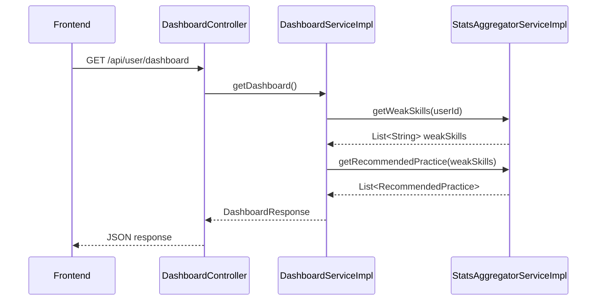
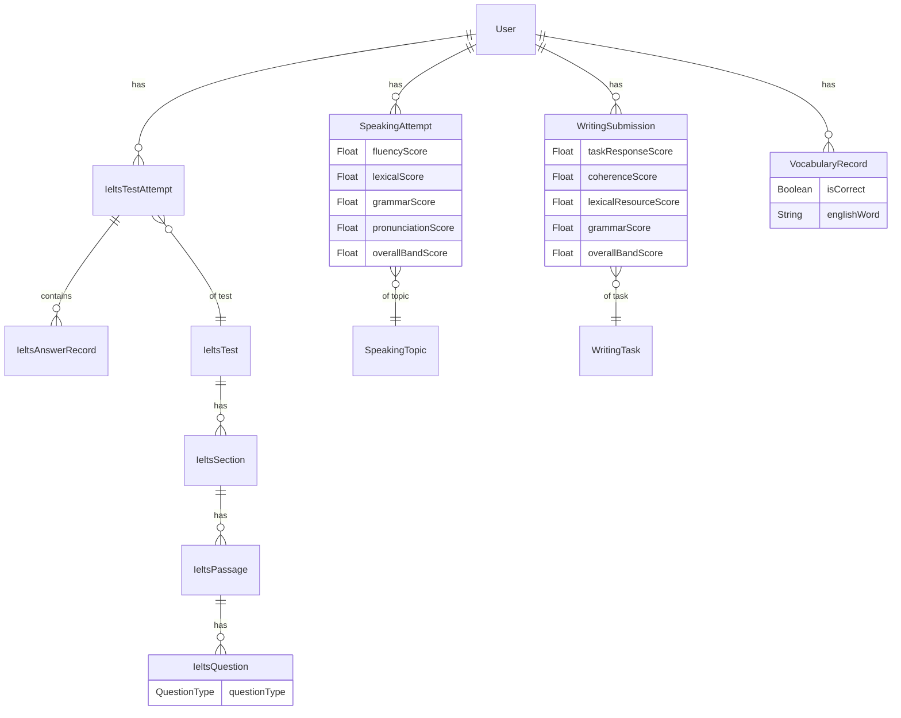
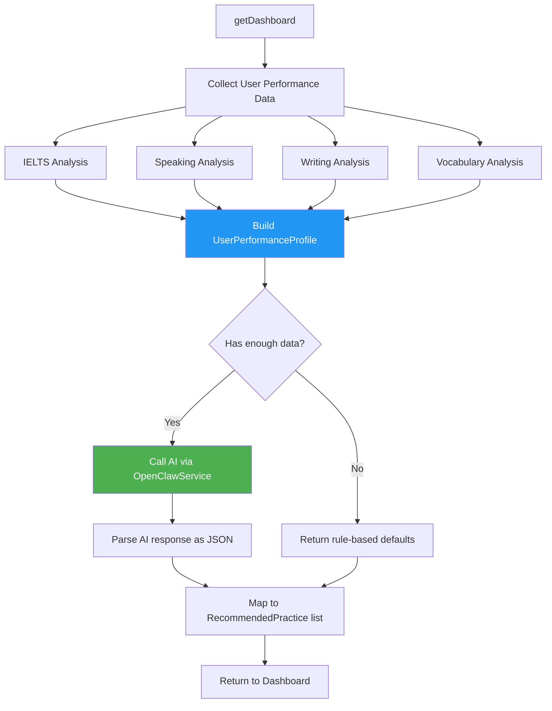
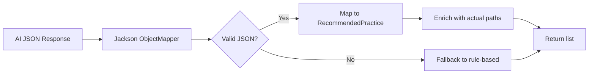
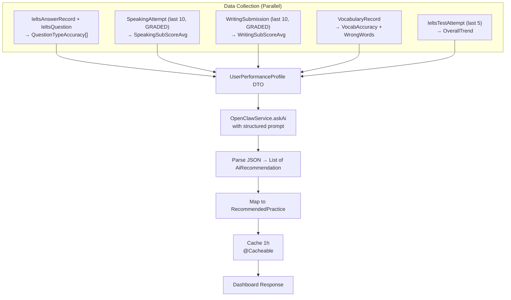
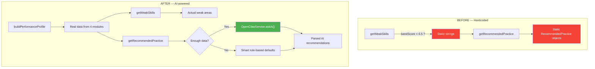

# Cải tiến RecommendPractice — Phân tích điểm yếu & Gợi ý luyện tập bằng AI

## 1. Phân tích hiện trạng

### 1.1. Luồng hiện tại



### 1.2. Vấn đề hiện tại của `UserStatsAggregatorServiceImpl`

#### `getWeakSkills(userId)` — Quá sơ sài

| Vấn đề | Chi tiết |
|---------|----------|
| **Chỉ dựa vào IELTS** | Bỏ qua hoàn toàn dữ liệu Speaking, Writing, Vocabulary |
| **Chỉ xem điểm bài gần nhất** | Không phân tích xu hướng, lịch sử nhiều bài |
| **Hardcode weak skills** | `bandScore < 6.5` → trả về cố định "True/False/Not Given" + "Multiple Choice" |
| **Default cứng** | Nếu không có dữ liệu → trả về "Academic Vocabulary" + "Map Labeling" |
| **Không phân tích question-level** | Không truy vấn `IeltsAnswerRecord` để biết user sai loại câu hỏi nào |

#### `getRecommendedPractice(weakSkills)` — Hoàn toàn tĩnh

| Vấn đề | Chi tiết |
|---------|----------|
| **Mapping cứng** | Weak skill string → static RecommendedPractice object |
| **Không cá nhân hóa** | Không dựa vào level, lịch sử, hay tiến độ của user |
| **Không link tới bài cụ thể** | path luôn là `/ielts` hoặc `/` — không gợi ý test/topic cụ thể |
| **Không có AI** | Không tận dụng OpenClawService đã có sẵn |

### 1.3. Dữ liệu có sẵn nhưng chưa khai thác



**Dữ liệu chưa được sử dụng:**
- `IeltsAnswerRecord.isCorrect` + `IeltsQuestion.questionType` → biết user yếu loại câu nào
- `SpeakingAttempt` 4 sub-scores → biết fluency/lexical/grammar/pronunciation yếu cái nào
- `WritingSubmission` 4 sub-scores → biết task response/coherence/lexical/grammar yếu cái nào
- `VocabularyRecord.isCorrect` → tỉ lệ từ vựng sai, các từ hay sai

---

## 2. Thiết kế mới — AI-powered Recommendation Engine

### 2.1. Kiến trúc tổng quan



### 2.2. Phase 1 — Rule-based Analysis (Không cần AI)

Trước khi gọi AI, cần thu thập dữ liệu thống kê thực sự từ lịch sử user:

#### a) IELTS Question-Type Analysis

```
Query: JOIN IeltsAnswerRecord với IeltsQuestion qua questionId
→ GROUP BY questionType
→ Tính: totalCount, correctCount, accuracy%
→ Lọc: accuracy < 60% → weak question type
```

**Ví dụ output:**
| QuestionType | Total | Correct | Accuracy |
|---|---|---|---|
| TRUE_FALSE_NOT_GIVEN | 20 | 8 | 40% ⚠️ |
| MULTIPLE_CHOICE | 15 | 12 | 80% ✅ |
| MAP_LABELING | 10 | 3 | 30% ⚠️ |

#### b) Speaking Sub-score Analysis

```
Query: Lấy N bài speaking gần nhất đã GRADED
→ Tính average cho mỗi sub-score
→ So sánh với ngưỡng (vd: < 5.5) hoặc tìm điểm thấp nhất
```

**Sub-scores:** `fluencyScore`, `lexicalScore`, `grammarScore`, `pronunciationScore`

#### c) Writing Sub-score Analysis

```
Query: Lấy N bài writing gần nhất đã GRADED
→ Tính average cho mỗi sub-score
→ So sánh với ngưỡng hoặc tìm điểm thấp nhất
```

**Sub-scores:** `taskResponseScore`, `coherenceScore`, `lexicalResourceScore`, `grammarScore`

#### d) Vocabulary Analysis

```
Query: Từ VocabularyRecord
→ Tính overall accuracy (correct/total)
→ Lấy frequently wrong words
```

### 2.3. Phase 2 — AI-powered Recommendations

Sau khi có `UserPerformanceProfile`, gọi `OpenClawService.askAi()` với prompt có cấu trúc:

#### Prompt Template

```
You are an IELTS tutor analyzing a student's practice history. 
Based on the following performance profile, provide 3-5 specific, 
actionable practice recommendations.

## Student Performance Profile:
- IELTS Listening/Reading:
  - Overall band: {bandScore}
  - Weakest question types: {weakQuestionTypes with accuracy%}
  - Total attempts: {count}
  - Trend: {improving/declining/stable}

- Speaking:
  - Overall band: {speakingBand}
  - Lowest sub-score: {lowestSubScore} ({score})
  - Practice count: {count}

- Writing:  
  - Overall band: {writingBand}
  - Lowest sub-score: {lowestSubScore} ({score})
  - Practice count: {count}

- Vocabulary:
  - Accuracy: {accuracy}%
  - Frequently wrong words: {wrongWords}

## Instructions:
Return ONLY a JSON array with this format:
[
  {
    "title": "...",
    "description": "...", 
    "type": "LISTENING|READING|SPEAKING|WRITING|VOCAB",
    "difficulty": "Easy|Medium|Hard",
    "estimatedTime": "X mins",
    "reason": "short explanation why this is recommended",
    "priority": 1-5
  }
]
Sort by priority (1 = highest). Be specific and encouraging.
```

#### AI Response Parsing



### 2.4. Data Flow chi tiết



---

## 3. Proposed Changes

### 3.1. New DTOs

#### [NEW] [UserPerformanceProfile.java](file:///d:/CODE2026/en-practice-be/src/main/java/com/swpts/enpracticebe/dto/response/dashboard/UserPerformanceProfile.java)

DTO tổng hợp hiệu suất user, gồm:
- `List<QuestionTypeAccuracy>` — accuracy theo từng loại câu hỏi IELTS
- `SkillSubScores speakingScores` — trung bình 4 sub-scores speaking
- `SkillSubScores writingScores` — trung bình 4 sub-scores writing
- `VocabStats vocabStats` — accuracy và danh sách từ hay sai
- `Float overallIeltsBand` — band gần nhất
- `String ieltsScoreTrend` — "IMPROVING" / "DECLINING" / "STABLE"
- `int totalIeltsAttempts`, `int totalSpeakingAttempts`, `int totalWritingAttempts`

Inner classes: `QuestionTypeAccuracy`, `SkillSubScores`, `VocabStats`

#### [NEW] [AiRecommendation.java](file:///d:/CODE2026/en-practice-be/src/main/java/com/swpts/enpracticebe/dto/response/dashboard/AiRecommendation.java)

DTO cho response từ AI, gồm:
- `String title`, `description`, `type`, `difficulty`, `estimatedTime`
- `String reason` — lý do AI gợi ý
- `int priority` — mức ưu tiên

#### [MODIFY] [RecommendedPractice.java](file:///d:/CODE2026/en-practice-be/src/main/java/com/swpts/enpracticebe/dto/response/dashboard/RecommendedPractice.java)

Thêm field `reason` để hiển thị lý do gợi ý cho user.

---

### 3.2. Repository Queries

#### [MODIFY] [IeltsAnswerRecordRepository.java](file:///d:/CODE2026/en-practice-be/src/main/java/com/swpts/enpracticebe/repository/IeltsAnswerRecordRepository.java)

Thêm native query JOIN `ielts_questions` để tính accuracy theo `questionType`:

```sql
SELECT q.question_type, 
       COUNT(*) as total, 
       SUM(CASE WHEN ar.is_correct THEN 1 ELSE 0 END) as correct_count
FROM ielts_answer_records ar
JOIN ielts_questions q ON ar.question_id = q.id
JOIN ielts_test_attempts a ON ar.attempt_id = a.id
WHERE a.user_id = :userId
GROUP BY q.question_type
```

#### [MODIFY] [SpeakingAttemptRepository.java](file:///d:/CODE2026/en-practice-be/src/main/java/com/swpts/enpracticebe/repository/SpeakingAttemptRepository.java)

Thêm query lấy N bài GRADED gần nhất:

```java
List<SpeakingAttempt> findTop10ByUserIdAndStatusOrderByGradedAtDesc(
    UUID userId, SpeakingAttempt.AttemptStatus status);
```

#### [MODIFY] [WritingSubmissionRepository.java](file:///d:/CODE2026/en-practice-be/src/main/java/com/swpts/enpracticebe/repository/WritingSubmissionRepository.java)

Thêm query tương tự:

```java
List<WritingSubmission> findTop10ByUserIdAndStatusOrderByGradedAtDesc(
    UUID userId, WritingSubmission.SubmissionStatus status);
```

---

### 3.3. Service Layer

#### [MODIFY] [UserStatsAggregatorService.java](file:///d:/CODE2026/en-practice-be/src/main/java/com/swpts/enpracticebe/service/UserStatsAggregatorService.java)

Cập nhật interface:

```java
public interface UserStatsAggregatorService {
    List<String> getWeakSkills(UUID userId);
    List<RecommendedPractice> getRecommendedPractice(UUID userId); // thay đổi: nhận userId thay vì weakSkills
    UserPerformanceProfile buildPerformanceProfile(UUID userId);
}
```

#### [MODIFY] [UserStatsAggregatorServiceImpl.java](file:///d:/CODE2026/en-practice-be/src/main/java/com/swpts/enpracticebe/service/impl/UserStatsAggregatorServiceImpl.java)

**Thay đổi lớn nhất.** Gồm:

1. **`buildPerformanceProfile(userId)`** — method mới, thu thập dữ liệu từ tất cả repositories:
   - Query `IeltsAnswerRecordRepository` JOIN `IeltsQuestion` → accuracy theo questionType
   - Query `SpeakingAttemptRepository` top 10 GRADED → trung bình sub-scores
   - Query `WritingSubmissionRepository` top 10 GRADED → trung bình sub-scores
   - Query `VocabularyRecordRepository` → accuracy + frequently wrong words
   - Tính trend từ 5 bài IELTS gần nhất

2. **`getWeakSkills(userId)`** — cải tiến, trả về weak skills thực tế dựa trên `UserPerformanceProfile`:
   - IELTS: question types có accuracy < 60%
   - Speaking: sub-score < 5.5
   - Writing: sub-score < 5.5
   - Vocabulary: accuracy < 70%

3. **`getRecommendedPractice(userId)`** — mới, gọi AI:
   - Build `UserPerformanceProfile`
   - Nếu có đủ dữ liệu (ít nhất 1 module có attempts) → gọi `OpenClawService.askAi()` với prompt có cấu trúc
   - Parse JSON response → `List<AiRecommendation>`
   - Map thành `List<RecommendedPractice>` với paths tương ứng
   - Nếu AI fail hoặc không có data → fallback về rule-based recommendations
   - Cache kết quả 1 giờ (`@Cacheable`)

#### [MODIFY] [UserDashboardServiceImpl.java](file:///d:/CODE2026/en-practice-be/src/main/java/com/swpts/enpracticebe/service/impl/UserDashboardServiceImpl.java)

Cập nhật dòng 56:
```diff
-List<RecommendedPractice> recommendedPractice = userStatsAggregatorService.getRecommendedPractice(weakSkills);
+List<RecommendedPractice> recommendedPractice = userStatsAggregatorService.getRecommendedPractice(userId);
```

---

### 3.4. Sơ đồ tổng kết thay đổi



---

## 4. Xử lý Edge Cases

| Case | Xử lý |
|------|--------|
| User mới, chưa có data nào | Trả về "Getting Started" recommendations: thử 1 bài mỗi module |
| Chỉ có data 1 module | Phân tích module đó + gợi ý thử các module khác |
| AI service down/timeout | Fallback về rule-based analysis từ `UserPerformanceProfile` |
| AI trả về JSON không hợp lệ | Log warning + fallback về rule-based |
| Tất cả scores đều cao | Gợi ý nâng difficulty, thử dạng câu chưa làm |

---

## 5. Verification Plan

### Automated Tests

Build project để verify compilation:
```bash
cd d:\CODE2026\en-practice-be
.\mvnw.cmd compile -q
```

### Manual Verification

1. Khởi chạy server, đăng nhập với user có lịch sử bài làm
2. Gọi `GET /api/user/dashboard` → verify `weakSkills` và `recommendedPractice` trả về data thực tế thay vì hardcoded
3. Test với user mới (không có data) → verify fallback recommendations
4. Cố tình kill AI service → verify fallback rule-based hoạt động
